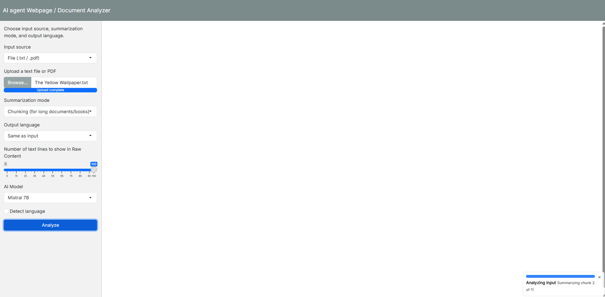
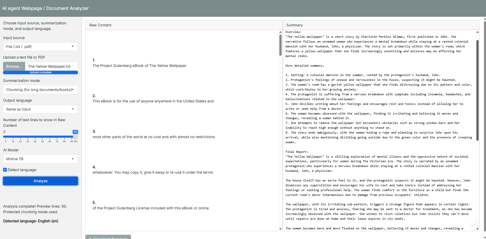
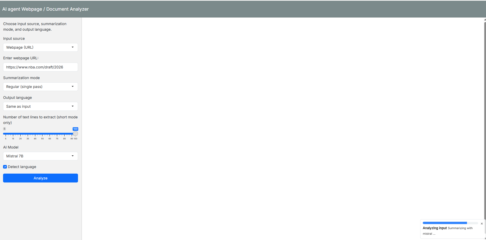
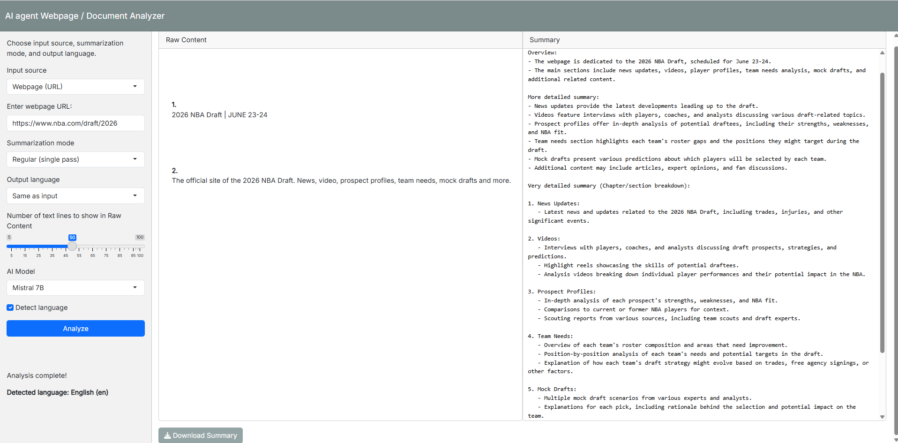

# AI agent Webpage / Document Analyzer 


AI Webpage / Document Analyzer is an R Shiny app that extracts visible text from web pages or uploaded `.txt`/`.pdf` files and generates structured summaries using a local LLM endpoint. It supports both single-pass summarization for shorter inputs and chunk-based summarization for long documents, books, or reports.

## Features

- Extracts text from webpages while removing common boilerplate such as navigation, headers, footers, cookie prompts, and ads.
- Reads uploaded `.txt` and `.pdf` files.
- Supports two summarization modes:
  - **Regular**: summarize the full text in one pass.
  - **Chunking**: split long text into chunks, summarize each chunk, then synthesize a final report.
- Produces a structured summary with three sections:
  - Overview
  - More detailed summary
  - Very detailed summary (chapter/section breakdown)
- Lets users choose the output language.
- Offers lightweight language detection for common Latin/Cyrillic cases.
- Supports multiple locally available models exposed through Ollama.
- Allows downloading the generated summary as a text file.

## Tech stack

- **R**
- **Shiny** + **bslib**
- **rvest** / **xml2** for HTML parsing
- **httr2** for HTTP requests
- **readtext** for file text extraction
- **Ollama** for local LLM inference

## Requirements

Before running the app, make sure you have:

- R installed
- A local Ollama instance running at `http://localhost:11434`
- At least one installed model matching the app options, such as:
  - `mistral`
  - `llama3.1`
  - `phi3`
  - `phi3:medium`

## Installation

### 1. Install R package dependencies

Run this in R or RStudio:

```r
install.packages(c(
  "shiny",
  "bslib",
  "rvest",
  "xml2",
  "httr2",
  "readtext"
))
```

### 2. Start Ollama

Example commands:

```bash
ollama serve
ollama list
ollama pull mistral
```

## Run the app

From R:

```r
shiny::runApp("app.R")
```

Or, if the project is opened in RStudio, click **Run App**.

## Usage

### Analyze a webpage

1. Choose **Webpage (URL)**.
2. Paste a valid URL.
3. Select summarization mode, output language, and model.
4. Click **Analyze**.
5. Review the extracted raw content and generated summary.

### Analyze a file

1. Choose **File (.txt / .pdf)**.
2. Upload a supported file.
3. Pick **Regular** or **Chunking** mode.
4. Click **Analyze**.
5. Download the summary if needed.

## Example workflow

```bash
# Start local model server
ollama serve

# In another terminal, verify the model exists
ollama list
```

```r
# Launch the app
shiny::runApp("app.R")
```

## Output format

The app generates summaries in this structure:

```text
Overview

More detailed summary

Very detailed summary (Chapter/section breakdown)
```

## Notes

- **Regular mode** is best for shorter webpages or short documents.
- **Chunking mode** is better for long-form text, books, or lengthy PDFs.
- If a model is missing, the app returns a helpful message so you can verify installed Ollama models.
- The current language detection is intentionally simple and based on script patterns.


## Roadmap

Possible next improvements:

- Add support for `.docx` and `.epub`
- Improve language detection
- Add unit tests for scraping and chunking
- Add Docker support
- Add deployment instructions for Shiny Server or Posit Connect

### Demo


## Screenshots


### Analyzing Input TXT



### Analysis Complete TXT



### Analyzing Input Web



### Analysis Complete Web



## Author

**Sergii Iuriev**

Data Scientist | AI/ML Developer | Software Engineer
